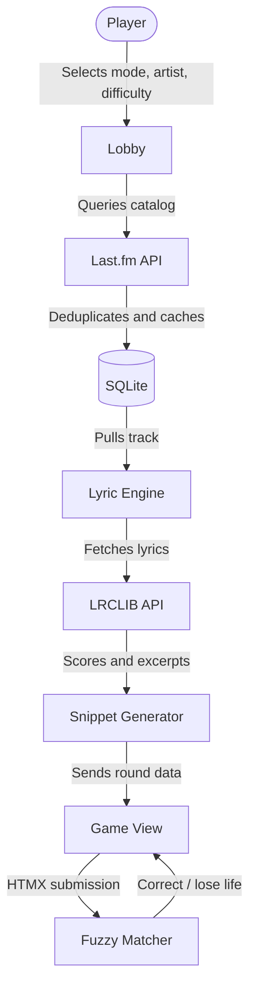

# Falsetto

Falsetto is a music trivia game. Pick an artist, pick a mode, and see how well you actually know their songs — not just the hits.

There are three ways to play. In **Complete the Lyrics**, the game shows you a verse with one word missing and you fill it in. In **Guess the Song**, you get a full verse with nothing hidden and have to name the track. In **Pick a Song**, you choose a specific song from an artist's catalog and the game quizzes you on it across multiple rounds, pulling a different blank each time.

It runs in the browser, no install needed. Accounts are optional — you only need one if you want your scores saved to the leaderboard.

---

## Screenshots

### Landing Page


### Lobby


### Gameplay


### End Screen


---

## How a round works

1. Pick an artist and a mode. For Complete the Lyrics and Guess the Song, also pick a difficulty and how many rounds you want. For Pick a Song, search the artist's catalog and select a track.
2. A lyric snippet appears — either with a word blanked out, or in full depending on the mode.
3. Type your answer and submit. Correct guesses score points and build your streak. Wrong guesses cost a life — you get three per game.
4. The game ends when you finish all rounds or run out of lives. Scores are saved to the leaderboard if you're logged in.

That's it.

---

## Scoring

$$\text{Score} = (\text{Base Score} + \text{Lives Bonus} + \text{Streak Bonus}) \times \text{Difficulty Multiplier}$$

* **Base Score**: 100 points per round
* **Lives Bonus**: +10 for each life still standing
* **Streak Bonus**: +15 for each consecutive correct answer
* **Multipliers**: Easy ×1.0 — Medium ×1.5 — Hard ×2.5 — Insane ×4.0

---

## Under the Hood

This section is for developers. Skip it if you just want to play.

### How songs are picked

Searching for an artist hits the **Last.fm API** and pulls their full catalog. The response gets deduplicated — live versions, remixes, and re-recordings are collapsed into their canonical track — and sorted by play count. That sorted list is what the difficulty tiers cut into:

* **Easy** — top 20% by play count
* **Medium** — 20–55%
* **Hard** — 55%+
* **Insane** — 75%+

The catalog is cached locally after the first fetch so repeat searches are instant and don't burn API quota.

### How lyrics are processed

Once a track is picked, **LRCLIB** returns the plain-text lyrics. Before anything reaches the player, the engine runs a few passes over the text: section headers like `[Chorus]` are stripped, blocks are scored by how many meaningful words they contain (filler words don't count), and any block that contains the song title is thrown out to prevent accidental giveaways. The highest-scoring block is picked as the excerpt.

For Complete the Lyrics and Pick a Song, a word is then chosen from that block — at least 4 letters, not a filler word, and in Pick a Song mode, not a word that's already been used in a previous round of the same session.

### Fuzzy matching

Typos and missing accents shouldn't cost you a life. The guess checker normalises both the guess and the answer — strips accents, punctuation, and casing — then runs a `difflib.SequenceMatcher` comparison. 85% similarity passes by default. You can override this with `GAME_FUZZY_THRESHOLD` in your `.env`.

### Sessions

Game state — current round, lives, score, streak, mode — lives in Django's server-side session for the duration of a match. Nothing is written to the database mid-game. The score record is created once, on the victory or game-over screen.

---

## Architecture



---

## Tech Stack

* **Backend** — Python 3.13, Django 6
* **Frontend** — HTMX for partial page updates, Tailwind CSS and daisyUI for styling
* **Auth** — django-allauth with custom user model, profile avatars, and account settings
* **Serving** — WhiteNoise for static files, Gunicorn for production
* **Tooling** — uv for dependency management, mise for runtime versions

---

## Project Structure

```
apps/
  game/      — game loop, all three modes, scoring, session management
  lyrics/    — Last.fm and LRCLIB integrations, local caching, excerpt engine
  pages/     — static pages, theme toggling, SEO
  users/     — custom user model, profiles, leaderboard

assets/      — Tailwind source, static images
core/        — settings, URLs, WSGI
templates/   — HTML templates organised by app
```

---

## Getting Started

You need **mise** and **uv** on your machine before anything else.

```bash
make install     # sets up Python, installs dependencies, builds CSS
make migrate     # creates the database
make superuser   # creates an admin account
make run         # starts the dev server at http://127.0.0.1:8000
```

To watch for CSS changes while developing:

```bash
make tailwind-watch
```

---

## All Commands

| Command | What it does |
| :--- | :--- |
| `make install` | Full setup — Python toolchain, dependencies, static assets |
| `make run` | Dev server with Tailwind |
| `make tailwind-watch` | Recompiles CSS on template changes |
| `make test` | Runs the test suite |
| `make migrations` | Generates migration files from model changes |
| `make migrate` | Applies migrations |
| `make superuser` | Creates a Django admin account |
| `make build` | Production build — minified CSS, collected static files |
| `make clean` | Removes cache files and build artifacts |
| `make serve` | Starts Gunicorn |