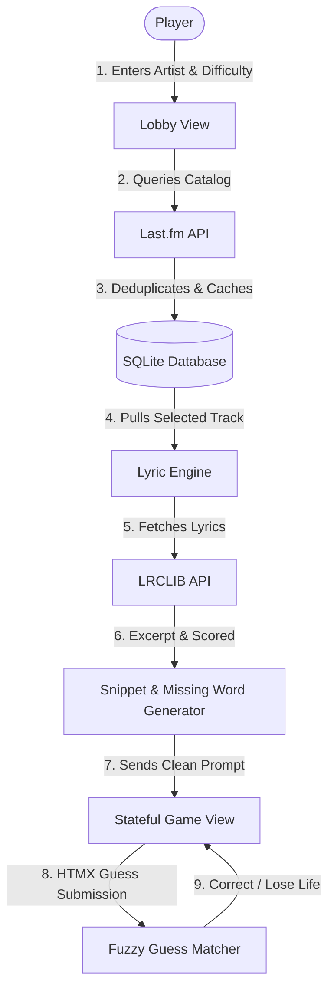

# Falsetto

Falsetto is a fast-paced web game that tests your music knowledge by challenging you to fill in the blanks of your favorite songs. You name the artist, choose the difficulty, and see if you can guess the missing word from a curated lyric snippet.

Built with a lightweight and modern Django stack, the game uses live external API integrations, an intelligent lyric-extraction engine, and a stateful in-memory game loop to keep matches quick, unpredictable, and highly responsive.

---

## The Visual Tour

Here is a quick look at the gameplay experience:

### 1. The Landing Page
*Welcome players with global stats, high scores, and quick navigation.*


### 2. The Game Lobby
*Configure your session with any artist, multiple difficulty tiers, and custom round counts.*


### 3. Active Gameplay
*A beautiful, minimalist interface that focuses entirely on the lyrics, powered by smooth asynchronous round transitions.*


### 4. Victory or Defeat
*Get a breakdown of your score, view a round-by-round summary of the tracks played, and claim your spot on the leaderboard.*


---

## How the Game Works

Falsetto is designed to be simple to pick up, but challenging to master. Here is the lifecycle of a single match:

1. **Setup the Lobby**: Enter any artist or band name. Select your difficulty level (**Easy**, **Medium**, **Hard**, or **Insane**) and decide how many rounds you want to play (1, 3, 5, or 10).
2. **The Lyric Snippet**: The game pulls a popular track from your chosen artist and extracts a high-quality 3-to-4 line verse. A single, meaningful word is masked with a blank (`________`).
3. **The Guess**: Type your guess in the input box.
   * **Correct Guess**: You score points and advance your winning streak.
   * **Incorrect Guess**: You lose one of your **3 lives**.
4. **Endgame**: The match ends when you successfully complete all rounds (**Victory!**) or lose all three lives (**Game Over**). If you are logged in, your score is compiled and saved to the global leaderboard.

---

## Under the Hood: Technical Architecture

Behind the clean user interface is a sophisticated coordination of external APIs, caching systems, and text-processing algorithms.



### 1. Sourcing and Cleaning the Catalog (Last.fm API)
When you search for an artist, the game queries the **Last.fm API** to pull their catalog. To make the pools fair and accurate, the system runs a custom deduplication pipeline:
* **Deduplication**: Filters out duplicate recordings, remixes, live tracks, and instrumentals by normalising song titles.
* **Volume Control**: Groups tracks into popularity tiers based on their real-world play counts.
* **Local Caching**: The artist's catalog is fully cached in the local database to speed up subsequent matches and limit external API queries.

### 2. Sourcing and Curating the Snippets (LRCLIB API)
Once a track is chosen, the engine connects to **LRCLIB** to fetch plain-text, unsynced lyrics. However, raw lyrics are often messy. The game's lyric engine runs a validation sweep to ensure a high-quality gameplay prompt:
* **Substance Scoring**: Blocks of lyrics are scored based on the density of meaningful words vs. generic filler.
* **Noise Removal**: Automatically strips brackets, formatting tags, section headers (e.g., `[Chorus]`, `[Verse 1]`), and redundant whitespace.
* **Anti-Spoilers**: The algorithm automatically discards any snippet that contains the song title in the lines, preventing dead giveaways.
* **Filler Filtering**: When masking a word, the game ignores common filler words (like *"yeah"*, *"oh"*, *"the"*, *"and"*) and only selects words with 4+ letters to ensure the blank requires genuine song knowledge.

### 3. Dynamic Difficulty Tiers
Rather than picking random songs, the difficulty levels correspond directly to the artist's real-world popularity distribution:
* **Easy**: Selects strictly from the artist's top **20%** most popular hits.
* **Medium**: Blends mid-tier favorites and signature tracks (**20% to 55%** of their catalog).
* **Hard**: Dives deeper into lesser-known tracks and b-sides (**55%+** of their catalog).
* **Insane**: Pulls exclusively from deep cuts and hidden gems (**75%+** of their catalog) with zero safety nets.

### 4. Stateful Session Management
To ensure lightning-fast gameplay, active matches do not write round-by-round state to the database. Instead, **Django's session engine** manages your active lobby, round index, current streak, lives remaining, and score in server-side memory. High scores are only written to the database once a match is completed.

### 5. Smart Fuzzy Matching
A music game shouldn't penalize you for minor typos or missing accents. The guess evaluation engine uses a lenient, multi-layered matching filter:
* **Unicode Normalization**: Accents and special characters are stripped (e.g., matching *"cafe"* to *"café"*).
* **Sanitization**: Strips all punctuation, trailing spaces, and converts input to lowercase.
* **Sequence Alignment**: Runs a character-level similarity calculation (`difflib.SequenceMatcher`). If your guess is at least **85%** similar to the answer, the game awards a correct match.

### 6. Dynamic Scoring Formula
Your score per round is calculated based on difficulty, surviving lives, and active streaks:

$$\text{Score} = (\text{Base Score} + \text{Lives Bonus} + \text{Streak Bonus}) \times \text{Difficulty Multiplier}$$

* **Base Score**: 100 points
* **Lives Bonus**: +10 points for each surviving life
* **Streak Bonus**: +15 points for each consecutive correct guess in your streak
* **Multipliers**: Easy (1.0x), Medium (1.5x), Hard (2.5x), Insane (4.0x)

---

## Tech Stack

Falsetto is built with a modern, high-performance web stack:

* **Backend**: Python 3.13 & Django 6
* **Frontend Interactivity**: **HTMX** (handles asynchronous, partial page updates for gameplay loops and screen transitions without full browser refreshes)
* **Styling & UI**: **Tailwind CSS** & **daisyUI** (providing responsive, modern components and a fluid dark/light theme switch)
* **User Management**: **Django-Allauth** (complete with custom profiles, avatar cropping/uploading, and settings)
* **Dependency & Tooling**: **uv** (lightning-fast package manager) & **mise** (runtime version manager)

---

## Project Structure

For developers looking at the code, the project is organized into clean, isolated Django apps:

```
├── apps/
│   ├── game/          # Coordinates game loops, scoring formulas, and lobby settings.
│   ├── lyrics/        # Manages Last.fm & LRCLIB integrations, caching, and excerpt extraction.
│   ├── pages/         # Static content (About, FAQ, Contact, legal terms, and theme toggling).
│   └── users/         # Handles custom user accounts, profile settings, and leaderboard stats.
├── assets/            # Tailwind CSS source files, styling inputs, and static assets.
├── core/              # Core Django settings, URL routing, and WSGI/ASGI configurations.
├── templates/         # Modular HTML templates, segmented by app context.
├── Makefile           # Simple, single-word terminal commands to manage the project.
├── pyproject.toml     # Modern packaging configurations managed by uv.
└── mise.toml          # Toolchain manager to keep development environments consistent.
```

---

## Getting Started

### Prerequisites
Make sure you have **mise** and **uv** installed on your system.

### 1. Environment Configuration
Create a `.env` file in the root of the project:
```bash
# Security & Debugging
DEBUG=True
SECRET_KEY=your-django-secret-key

# Database (Default is SQLite)
DATABASE_URL=sqlite:///db.sqlite3

# External APIs
LASTFM_API_KEY=your_lastfm_api_key
LASTFM_BASE_URL=https://ws.audioscrobbler.com/2.0/
```

> **Note**: You will need a free API key from [Last.fm's Developer API portal](https://www.last.fm/api) to fetch track catalogs. LRCLIB searches are open and do not require credentials.

### 2. Automated Installation
Run the installer target to set up your Python version, sync all dependencies, and initialize the Tailwind styling engine:
```bash
make install
```

### 3. Database Initialization & Admin Setup
Create your local database tables and spin up an administrator account to access the Django backend:
```bash
make migrate
make superuser
```

### 4. Running the Development Server
Run the local server:
```bash
make run
```
Your server will start at `http://127.0.0.1:8000`.

To edit styles, you can run the Tailwind watch process in a separate terminal window:
```bash
make tailwind-watch
```

---

## Everyday Development Commands

Use the `Makefile` shortcuts to speed up your daily workflows:

| Command | Description |
| :--- | :--- |
| `make install` | Setup the Python toolchain, install dependencies, and build static assets. |
| `make run` | Starts the local Django server with Tailwind compiled on the fly. |
| `make tailwind-watch` | Automatically monitors template changes and live-recompiles Tailwind utility classes. |
| `make test` | Executes the comprehensive test suite across all application modules. |
| `make migrations` | Detects changes in models and prepares database migration files. |
| `make migrate` | Applies pending migrations to the local database. |
| `make superuser` | Creates an administrator login for `/admin`. |
| `make build` | Builds minified Tailwind styles and compiles static assets for production deployment. |
| `make clean` | Removes local Python cache files, test artifacts, and temporary builds. |
| `make serve` | Runs a production-ready WSGI server bound using Gunicorn. |